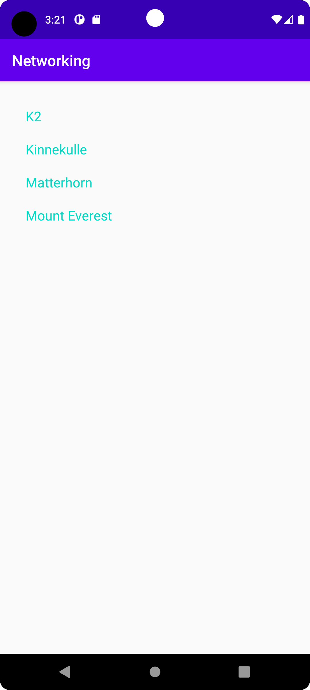

# Rapport

Det första jag gjorde var att lägga till en recyclerview widget samt en layout fil på activityn. 
Sedan skapade jag en item klass och en item list xml fil. Detta för att representera 
ett item.
```
public class MountainItem {
     private String name;

     public MountainItem (String name) {
         this.name = name;
     }
     public String getName() {
         return name;
     } 
}
```
Efter detta skapade jag en RecyclerViewAdapter samt la till kod i Main Activity för att kunna översätta datan från Json filerna med hjälp av Gson.

```
new JsonFile(this, this).execute(JSON_FILE);
new JsonTask(this).execute(JSON_URL);

Gson newGson = new Gson();
Type newType = new TypeToken<List<MountainItem>>() {}.getType();
items = newGson.fromJson(json, newType);
```
Till sist med hjälp av en OnClickListener för RecyclerViewAdapterns objekt kan vi visa datan för det itemet som vi klickar på.
I detta fall är det bara namnet på berget.
```
RecyclerViewAdapter adapter = new RecyclerViewAdapter(this, items, new RecyclerViewAdapter.OnClickListener() {
            @Override
            public void onClick(MountainItem item) {
                Toast.makeText(MainActivity.this, item.getName(), Toast.LENGTH_SHORT).show();
            }
        });
```


